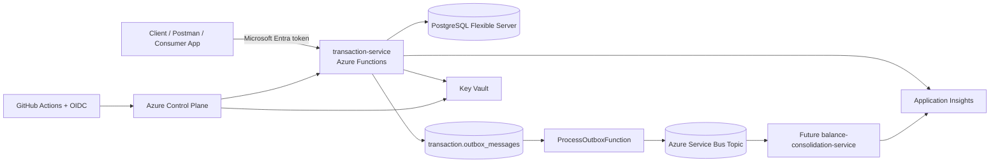

# Cashflow

Monorepo for the cashflow challenge solution.

## Current status

This repository currently implements the **transaction-service** and its supporting infrastructure. The **daily balance consolidation service** is documented as the next planned service and is not yet implemented.

## Solution overview

The solution uses a serverless and event-driven approach on Azure:

- **transaction-service** receives debit and credit entries through HTTP endpoints hosted on Azure Functions (.NET isolated).
- Transactions are stored in PostgreSQL.
- An **outbox table** guarantees that integration events are persisted in the same transaction as the write model.
- A timer-triggered function reads the outbox and publishes events to Azure Service Bus.
- The future **balance-consolidation-service** will consume those events and materialize the daily consolidated balance.

## Architecture

## Repository layout

- `transaction-service/` application code, tests and local development assets.
- `db-migrator/` migration runner used locally and in CI/CD.
- `infra/` Terraform modules, environment configuration and bootstrap for remote state.
- `docs/` architecture, operations and requirement coverage documentation.

## Architectural decisions and trade-offs

- **Azure Functions isolated worker** keeps hosting simple and cost-effective, but introduces a little more complexity around local settings and worker middleware compared to an ASP.NET Core API.
- **Transactional outbox** favors reliability and decoupling over implementation simplicity. It avoids losing events when the downstream consolidation service is unavailable.
- **PostgreSQL** keeps the write model and idempotency state in a single transactional store. This is simpler than a multi-store design, but means availability and network strategy must be carefully planned.
- **Service Bus topic** was selected to decouple the write model from future consumers. The trade-off is additional operational complexity and the need for idempotent consumers.
- **GitHub OIDC** removes long-lived deployment secrets, but requires additional Microsoft Entra and Key Vault permissions to be wired correctly.

## Running locally

1. Start a local PostgreSQL instance.
2. Apply database migrations with the `db-migrator`.
3. Configure `transaction-service/src/TransactionService.Api/local.settings.json` from the provided template.
4. Run the Azure Function locally.

See the detailed docs:

- [`docs/architecture.md`](docs/architecture.md)
- [`docs/bcdr.md`](docs/bcdr.md)
- [`docs/requirements-assessment.md`](docs/requirements-assessment.md)

## Planned improvements

- Implement the `balance-consolidation-service` and its consumer pipeline.
- Add VNet integration with dedicated subnets for Functions, PostgreSQL private access and private endpoints.
- Add BC/DR runbook with failover strategy and operational drills.
- Introduce distributed tracing, custom metrics, dashboards and alerting for function execution, outbox lag and publish failure rate.
- Add contract tests and integration tests against ephemeral infrastructure.
