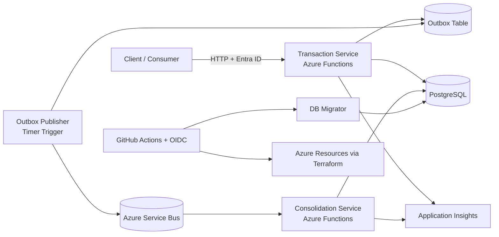

# Cashflow Challenge Solution

## Executive Summary

This repository contains an enterprise-style solution for the software architect challenge. The implementation is intentionally split into independent workloads so that transaction ingestion remains available even when daily consolidation is delayed or temporarily unavailable.

The solution is composed of three main building blocks:

- **Transaction Service**: receives debit and credit requests, persists the transaction, and records an outbox event in the same database transaction.
- **Consolidation Service**: asynchronously consumes transaction batches, calculates daily balances, updates the consolidated read model, and controls retries and manual error handling.
- **DB Migrator**: lightweight console application executed from CI/CD to apply ordered SQL migrations directly to PostgreSQL before deployment.

The architecture emphasizes the challenge goals of scalability, resilience, security, observability, and clear architectural decision-making. The implementation also documents conscious trade-offs and future improvements rather than pretending the first delivery is the final state.

---

## Business Problem

A merchant needs to:

- record daily financial entries (**debit** and **credit**);
- keep the write path responsive and available;
- generate a **daily consolidated balance** for reporting.

This repository addresses the problem with an event-driven, serverless design that decouples transaction capture from balance consolidation.

---

## Solution Overview

### 1. Transaction Service

The Transaction Service is the synchronous write path.

Responsibilities:

- accept debit and credit requests;
- validate input and business rules;
- persist transactions;
- register an outbox message in the same transaction;
- expose transaction query endpoints;
- publish pending outbox messages to Azure Service Bus through a scheduled Azure Function.

Why this matters:

- the transaction API does **not** depend on the consolidation worker being online;
- the service remains available even if the downstream consumer fails;
- data loss risk is reduced by persisting the integration event before attempting publication.

### 2. Consolidation Service

The Consolidation Service is the asynchronous balance processor.

Responsibilities:

- consume transaction batch messages from Azure Service Bus;
- create or load a logical processing batch;
- validate and load pending transactions;
- aggregate amounts by day;
- update the `daily_balance` read model;
- mark processed transactions;
- retry failed batches with bounded attempts;
- send exhausted failures to a manual review table.

Why this matters:

- consolidation can scale independently from the write path;
- downstream instability does not block the merchant from recording transactions;
- consolidation behavior is observable and recoverable.

### 3. DB Migrator

The DB Migrator is a small but important operational component.

Responsibilities:

- load SQL scripts from a configured folder;
- apply them in deterministic filename order;
- record execution history in `__schema_migrations`;
- validate migration integrity with checksums;
- fail fast if an already-applied migration was modified.

Why this matters:

- database changes become part of the delivery pipeline;
- infrastructure and application deployments stop depending on manual SQL execution;
- migration history becomes auditable and repeatable.

---

## High-Level Architecture



---

## Architectural Style

The solution combines:

- **Serverless Architecture** through Azure Functions;
- **Event-Driven Architecture** through Azure Service Bus;
- **Microservice-oriented decomposition** by splitting synchronous transaction ingestion from asynchronous consolidation.

This is a pragmatic choice rather than architecture for architecture’s sake. The challenge explicitly asks for scalability, resilience, security, integration patterns, and non-functional reasoning. A serverless and event-driven design addresses these goals with relatively low infrastructure overhead.

---

## Core Design Decisions

### Why Azure Functions

Azure Functions was selected to reduce infrastructure management effort while still enabling automatic scaling and native trigger-based execution.

Benefits:

- elastic scale for variable workloads;
- low idle cost compared with always-on compute;
- good fit for HTTP, timer, and Service Bus triggers;
- simpler operational model for a challenge delivery.

Trade-off:

- cold starts may add latency under low traffic periods;
- some advanced hosting/network scenarios require more platform-specific setup.

### Why asynchronous consolidation

Daily balance calculation was intentionally separated from transaction ingestion.

Benefits:

- the transaction service stays available if consolidation is degraded or offline;
- read and write workloads can evolve independently;
- backpressure can be absorbed through the messaging layer.

Trade-off:

- balance is **eventually consistent**, not immediately consistent.

This is acceptable for the challenge because resilience and availability are more critical than forcing synchronous coupling.

### Why Outbox Pattern

The outbox guarantees that transaction persistence and event registration occur in the same local database transaction.

Benefits:

- prevents the classic failure case where the transaction is saved but the integration event is lost;
- enables reliable delayed publication;
- supports temporary downstream failures.

Trade-off:

- adds an extra table and a scheduled publisher process.

### Why idempotency in both services

Financial operations cannot rely on “at most once” assumptions.

The design therefore includes:

- request-level idempotency for transaction creation;
- batch-level idempotency in the consolidation workflow.

Benefits:

- protects against retries, duplicate message delivery, and reprocessing;
- avoids duplicate balance updates.

Trade-off:

- requires additional persistence and validation logic.

### Why DB Migrator in the pipeline

Database migrations are handled by a dedicated console tool executed before deployment.

Benefits:

- schema changes become reproducible and automated;
- the pipeline can prepare the database before application rollout;
- checksum validation avoids silent drift caused by editing old migrations.

Trade-off:

- requires deployment discipline: once a migration is applied, changes should be introduced through new scripts rather than by editing existing files.

---

## Observability Strategy

Application Insights is used as the main telemetry sink.

### Correlation model

A **Correlation ID** should be created at the edge of the transaction request and propagated through:

- Transaction Service request scope;
- Outbox record;
- Service Bus message metadata/body;
- Consolidation Service processing scope;
- error and retry records.

This enables end-to-end tracing across the full business flow:

`request -> transaction persistence -> outbox publication -> bus delivery -> consolidation -> balance update`

### Recommended telemetry dimensions

- `CorrelationId`
- `TransactionId`
- `BatchId`
- `MessageId`
- `RetryCount`
- `FunctionName`
- `ProcessingStatus`

### Recommended dashboards and alerts

- failed HTTP requests in Transaction Service;
- outbox backlog size and publication age;
- Service Bus delivery failures and dead-letter growth;
- consolidation retry count and exhausted retries;
- migration execution failures in CI/CD.

---

## Security Overview

The solution uses **Microsoft Entra ID** for protected access and **GitHub OIDC** for deployment authentication.

Security considerations already present or documented:

- identity-based access for application APIs;
- secret retrieval from Key Vault in the pipeline;
- no need for long-lived deployment secrets when OIDC is correctly configured.

Planned hardening:

- VNet integration;
- dedicated subnets for functions and database;
- private endpoints;
- tighter network isolation for production-grade environments.

---

## Reliability and Failure Handling

### Transaction path

The transaction path is designed to succeed even when consolidation is unavailable.

How:

- transaction write is local to PostgreSQL;
- outbox event is stored in the same transaction;
- publication is retried later by a timer-triggered function.

### Consolidation path

The consolidation workflow supports bounded retries.

How:

- transient failures can be retried;
- permanent or exhausted failures are written to a manual handling table;
- failed batches are isolated from healthy processing.

### Known trade-off

At the current stage, if a batch cannot be processed correctly, the **whole batch** is treated as failed.

Reason:

- simpler and safer first implementation for a financial challenge;
- avoids hidden partial-processing bugs during the initial delivery window.

Planned evolution:

- item-level fallback to isolate only invalid transactions inside a batch.

---

## Scalability Considerations

The challenge mentions a consolidation throughput scenario with burst traffic and limited request loss. This solution addresses that with the following mechanisms:

- serverless scale-out for trigger-based workloads;
- asynchronous decoupling through Service Bus;
- batch-oriented consolidation processing;
- independent scaling of ingestion and consolidation workloads.

Practical note:

- exact throughput targets still depend on SKU, host plan, function concurrency, database sizing, lock behavior, and Service Bus configuration.
- for the challenge, the chosen architecture is aligned with the required direction and leaves room for capacity tuning.

---

## Repository Structure

```text
cashflow/
  .github/workflows/         CI/CD pipelines
  consolidation-service/     asynchronous daily balance processor
  db-migrator/               schema migration runner used locally and in pipeline
  infra/                     Terraform infrastructure as code
  transaction-service/       synchronous transaction ingestion service
  README.md                  executive overview and system documentation
  ARCHITECTURE.md            architecture details and design decisions
  OPERATIONS.md              run, deploy, and monitor guidance
  REQUIREMENTS_TRACEABILITY.md  mapping to challenge requirements
```

---

## Local Execution

### Prerequisites

- .NET 8 SDK
- PostgreSQL
- Azure Functions Core Tools
- optional Azurite for local storage emulation

### Suggested local sequence

1. Configure PostgreSQL.
2. Run the **DB Migrator** against the transaction scripts and consolidation scripts as needed.
3. Configure `local.settings.json` for both Function Apps.
4. Start the Transaction Service.
5. Start the Consolidation Service.
6. Publish transactions and validate the consolidated balance tables.

For operational details, see [OPERATIONS.md](OPERATIONS.md).

---

## Future Improvements

The current delivery intentionally favors clarity and correctness over premature complexity. The following improvements are documented as future evolution:

- item-level fallback inside failed batches;
- richer dead-letter handling automation;
- full private networking with dedicated subnets;
- stronger dashboarding and alerting baseline;
- broader automated integration and load tests;
- message contract versioning;
- more advanced retry and backoff tuning;
- separate read API for consolidated balance if external read demand grows.

---

## Final Positioning

This repository is not only a coding exercise. It is structured to demonstrate architectural reasoning:

- decomposition of responsibilities;
- reliability patterns for distributed systems;
- operational awareness;
- security-minded delivery;
- conscious trade-offs;
- documentation suitable for technical review.

That is the main reason the documentation is centralized at the repository root: the evaluator can understand the complete system from a single entry point.
