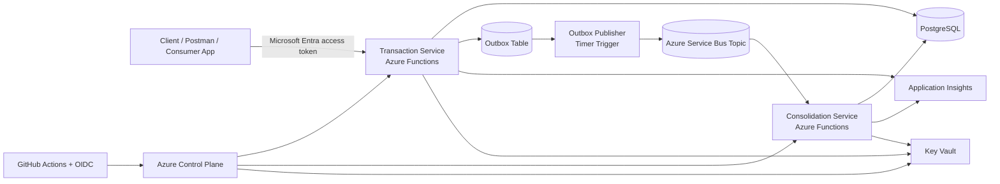

# Cashflow Challenge Solution

## Executive Summary

This repository contains a cashflow challenge solution designed around **two business services** and **one operational support component**:

1. **Transaction Service**
   Receives debit and credit transactions, validates requests, persists data in PostgreSQL, and records integration events using the outbox pattern.

2. **Consolidation Service**
   Processes published transaction batches asynchronously and updates the **daily consolidated balance** read model.

3. **DB Migrator**
   Applies ordered SQL migrations to PostgreSQL in a deterministic and auditable way.

The solution was designed so that the **transaction write path remains available even if consolidation is delayed or temporarily unavailable**, directly addressing the main non-functional requirement of the challenge.

---

## Challenge Scope Coverage

The challenge asks for:

- a service to control transactions;
- a service to generate the daily consolidated balance;
- design decisions and architectural documentation;
- code, tests, and clear execution guidance in a public repository.

This repository addresses that scope with:

- **Transaction Service** for the synchronous write path;
- **Consolidation Service** for the asynchronous daily balance processing path;
- **DB Migrator** for controlled schema evolution;
- supporting documentation under `docs/`.

For a requirement-by-requirement view, see [docs/requirements-traceability.md](./docs/requirements-traceability.md).

---

## Solution Overview

The architecture follows a **serverless, event-driven, decoupled** design on Azure.

- **Transaction Service** receives requests over HTTP on Azure Functions (.NET isolated).
- Transactions are persisted in **PostgreSQL**.
- An **outbox table** guarantees that integration events are stored in the same transaction as the write model.
- A timer-triggered publisher reads the outbox and sends messages to **Azure Service Bus**.
- **Consolidation Service** consumes transaction batches asynchronously and updates the `daily_balance` read model.
- **Application Insights** centralizes logs and telemetry.
- **Terraform** provisions the main cloud infrastructure.
- **GitHub Actions with OIDC** automates build and deployment without long-lived deployment secrets.

---

## Architecture at a Glance

