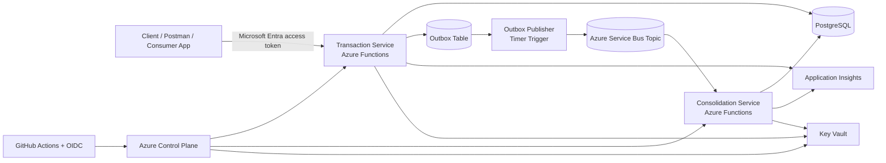

# Cashflow Solution

## Overview

This solution implements a cash flow management system designed to handle financial transactions and provide **daily consolidated balance reports per merchant**.

The architecture was designed to meet strict non-functional requirements such as:

- High availability of the transaction ingestion service
- Support for peak loads (≥ 50 requests per second)
- Controlled eventual consistency for balance consolidation
- Fault tolerance with minimal data loss (≤ 5%)

---

## Architecture

The system is composed of three main components:

### 1. Transaction Service

Responsible for receiving, storing and exposing financial data.

- Synchronous HTTP API
- Persists transactions in PostgreSQL
- Uses **Outbox Pattern** to guarantee reliable event publishing
- Exposes read endpoints for both transactions and consolidated balance
- Does NOT depend on consolidation to respond

Endpoints:

- `POST /api/transactions` → Register transaction
- `GET /api/transactions/{id}` → Retrieve transaction
- `GET /api/daily-balance/{date}` → Retrieve consolidated daily balance per merchant

The daily balance query reads from a **pre-aggregated table (`daily_balance`)**, ensuring fast and scalable reads.

---

### 2. Consolidation Service (Worker)

Responsible for processing transactions asynchronously and updating the daily balance.

- Consumes events from Azure Service Bus
- Processes transactions in batches
- Aggregates values per:
  - Date
  - Merchant
  - Transaction type (credit/debit)

- Updates `daily_balance` table

⚠️ This service is **eventually consistent** and runs asynchronously.

---

### 3. DB Migrator

- Applies database schema migrations
- Ensures environment consistency

---

## Daily Balance (Business Requirement)

The system maintains a **daily consolidated balance per merchant**, calculated as:

- Sum of credits
- Sum of debits
- Final balance per day

The balance is exposed via the Transaction Service:

- `GET /api/daily-balance/{date}`

Example:

GET /api/daily-balance/2026-01-01

The balance is:

- NOT updated in real-time
- Updated asynchronously within a short delay window (typically a few seconds, up to ~30 seconds)

This design ensures system scalability and resilience.

---

## Non-Functional Requirements Strategy

### ✔ High Availability

The Transaction Service is fully independent from the Consolidation Service.

Even if consolidation is unavailable:

- Transactions continue to be accepted
- Events are safely stored (Outbox)
- Processing resumes later

---

### ✔ Throughput (≥ 50 req/s)

Handled by:

- Stateless Transaction Service
- Fast writes to PostgreSQL
- Asynchronous processing via Service Bus
- No synchronous coupling between services

Instead of performing heavy calculations during the request, the system:

1. Persists the transaction quickly
2. Publishes an event using the Outbox pattern
3. Processes consolidation asynchronously

This ensures the system can sustain high throughput without degrading response times.

---

### ✔ Data Loss Control (≤ 5%)

Achieved through:

- Transactional Outbox Pattern
- Guaranteed delivery via Service Bus
- Retry policies in worker
- Dead-letter handling for failures

---

### ✔ Eventual Consistency

To meet performance and availability requirements:

- Balance updates are **not real-time**
- Consolidation is processed asynchronously
- Delay is acceptable (few seconds up to ~30 seconds)

This trade-off is intentional and aligned with system scalability goals.

---

## How to Run Locally

### Prerequisites

- .NET 8
- Docker
- PostgreSQL
- Azure Service Bus (or emulator if configured)

---

### Steps

1. Start PostgreSQL (via Docker or local instance)

2. Run DB Migrator:

```bash
dotnet run --project db-migrator
```

3. Run Transaction Service:

```bash
dotnet run --project transaction-service
```

4. Run Consolidation Worker:

```bash
dotnet run --project consolidation-service
```

---

## Testing

The solution includes:

- Unit Tests
- Application Layer Tests

Future improvements:

- Integration tests
- Load tests (to validate throughput empirically)

---

## CI/CD

GitHub Actions pipelines are configured to:

- Build
- Run tests
- Deploy infrastructure (Terraform)
- Deploy services

---

## Architectural Decisions

Key design patterns used:

- Outbox Pattern
- Event-driven architecture
- Worker-based background processing
- Eventual consistency
- Idempotent processing

---

## Trade-offs

| Decision                  | Reason                                      |
| ------------------------- | ------------------------------------------- |
| Eventual consistency      | Enables high throughput and availability    |
| Asynchronous processing   | Prevents blocking transaction ingestion     |
| Pre-aggregated read model | Enables fast and scalable queries           |
| Batch processing          | Improves performance and reduces contention |

---

## What is Implemented vs Future Improvements

### Implemented

- Transaction ingestion API
- Daily balance query API (`/api/daily-balance/{date}`)
- Reliable event publishing (Outbox)
- Asynchronous consolidation
- Daily balance aggregation logic
- Error handling and retry mechanisms
- CI/CD pipelines
- Infrastructure as Code

### Future Improvements

- Load testing automation
- Observability improvements (metrics, dashboards)
- Advanced retry/backoff strategies
- Multi-region resilience (if required)

---

## Final Notes

This solution prioritizes:

- Reliability over immediacy
- Scalability over synchronous consistency
- Clear separation of responsibilities

The architecture ensures that transaction ingestion remains stable under load, while consolidation is handled asynchronously with controlled eventual consistency.

## Architecture at a Glance



## Implementation Status

This solution focuses on demonstrating architectural decisions and system design aligned with the requirements.

The core flows are implemented and functional, including:

- Transaction ingestion
- Reliable event publishing (Outbox)
- Asynchronous consolidation
- Daily balance aggregation
- Query API for consolidated data

Some aspects were intentionally left as next steps or partially validated:

- Full end-to-end validation under load
- Automated load testing for throughput verification (≥ 50 req/s)
- Extended integration testing across services

These decisions were made to prioritize clarity of architecture, separation of concerns, and non-functional requirement strategies.

The current implementation demonstrates how the system behaves and scales, even if not all scenarios were exhaustively tested.
