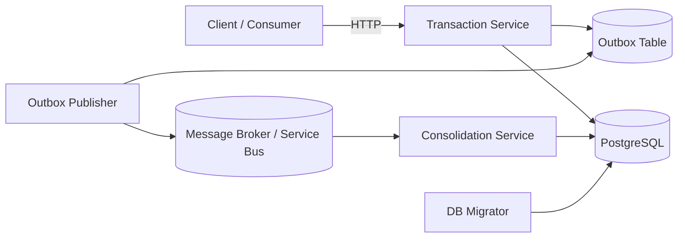

# Cashflow Challenge Solution

## Executive Summary

This repository contains a software architect challenge solution for a cashflow scenario with **two business services** and **one operational support component**:

1. **Transaction Service**
   Responsible for receiving debit and credit transactions, validating requests, persisting data in PostgreSQL, and registering integration events through the outbox pattern.

2. **Consolidation Service**
   Responsible for asynchronously processing published transaction batches and updating the **daily consolidated balance** read model.

3. **DB Migrator**
   Responsible for applying ordered SQL migrations to PostgreSQL in a deterministic and auditable way.

The solution is intentionally designed so that the **transaction write path remains available even if the consolidation flow is delayed or temporarily unavailable**.

---

## Challenge Scope Coverage

The challenge asks for:

- a service to control financial transactions;
- a service to generate the daily consolidated balance;
- clear architectural decisions;
- code and documentation in the repository;
- tests and execution guidance.

This repository addresses that scope with:

- **Transaction Service** for the synchronous write path;
- **Consolidation Service** for the asynchronous daily balance processing path;
- **DB Migrator** for controlled schema evolution;
- architecture and operational documentation organized under `docs/`.

---

## Current Implementation Status

### Fully Functional

#### Transaction Service

Implemented capabilities:

- `POST /api/transactions`
- `GET /api/transactions/{transactionId}`
- PostgreSQL persistence
- request-level idempotency
- transactional outbox persistence
- scheduled outbox publication
- Application Insights integration hooks
- layered structure with Domain / Application / Infrastructure / API

This service is the **main synchronous entry point** and is the most complete part of the solution.

---

### Functional MVP

#### Consolidation Service

Implemented capabilities:

- asynchronous batch consumption
- batch lifecycle tracking
- transaction loading from PostgreSQL
- daily aggregation by date
- upsert into `daily_balance`
- processed transaction marking
- bounded retry behavior
- manual review registration for exhausted failures
- layered structure with Domain / Application / Infrastructure / Worker

This service is **implemented as a functional MVP**, demonstrating architectural separation, resilience, and recoverability.

---

### Operational Support Component

#### DB Migrator

Implemented capabilities:

- ordered SQL execution
- migration history tracking
- checksum validation
- fail-fast behavior for migration drift

---

## What Is Implemented End-to-End

The repository implements the following **end-to-end business flow**:

1. a client sends a debit or credit request to **Transaction Service**;
2. the transaction is validated and persisted in PostgreSQL;
3. an **outbox event** is recorded in the same database transaction;
4. a scheduled publisher reads pending outbox entries and publishes a batch message;
5. **Consolidation Service** consumes the message asynchronously;
6. transactions are loaded and aggregated by date;
7. the `daily_balance` read model is updated;
8. transactions are marked as processed.

This demonstrates the **decoupled integration between write and processing paths**.

---

## high-Level Architecture

