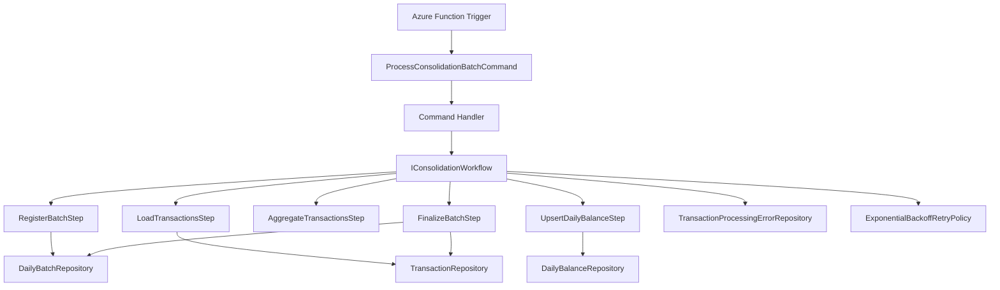

# Architecture

## Context

The challenge requires a transaction control service and a daily consolidation service. The write path must stay available even when consolidation fails.

This solution keeps **Transaction Service** responsible for transaction intake and balance read exposure, while **Consolidation Service** processes daily balances asynchronously.

## High-level diagram

```mermaid
flowchart LR
    client[Client / Postman] --> ts[Transaction Service]
    ts --> db[(PostgreSQL)]
    ts --> topic[[Azure Service Bus Topic]]
    topic --> cs[Consolidation Service]
    cs --> db
    ai[(Application Insights)]
    ts --> ai
    cs --> ai
    ts -->|GET /api/saldos/{date}| db
```

## Component responsibilities

### Transaction Service

- accepts debit and credit transactions;
- persists transactions;
- publishes batch messages with transaction ids;
- exposes the daily balance endpoint by querying `daily_balance`.

### Consolidation Service

- receives Service Bus messages;
- validates the message;
- orchestrates consolidation steps;
- updates `daily_balance`;
- tracks batch state in `daily_batch`;
- sends unrecoverable items to `transaction_processing_error`.

## Internal dependency diagram



## Reasons for the main decisions

- **Asynchronous consolidation** protects transaction intake from consolidation outages.
- **Batch ids and transaction ids** reduce broker payload size and make reprocessing easier.
- **Manual pipeline orchestration** keeps the code clear and straightforward for reviewers.
- **PostgreSQL materialized read model** keeps the balance endpoint fast and simple.
- **Application Insights and structured logging** improve troubleshooting and auditability.
