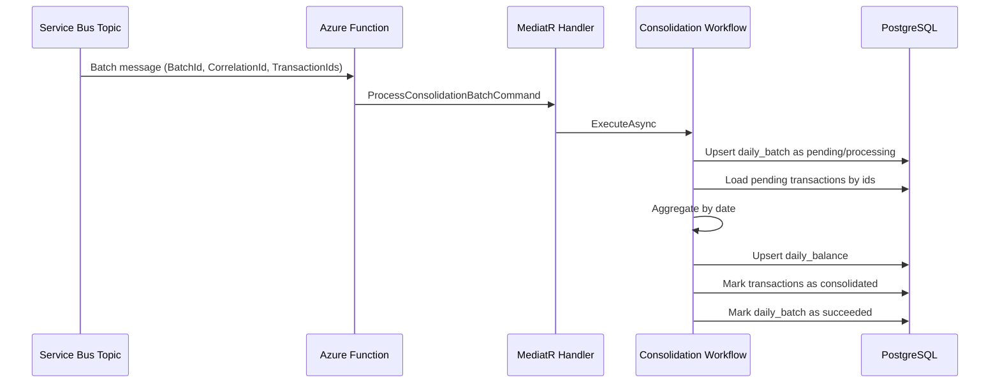
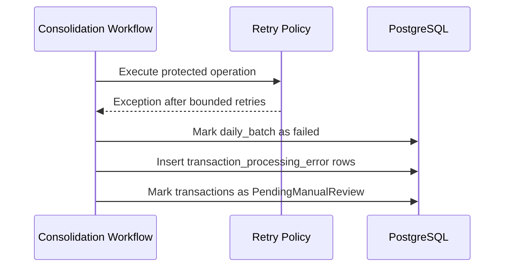

# Consolidation workflow

## Sequence diagram

## Failure path

## Step contract

1. `RegisterBatchStep`
   - prevents duplicate successful processing;
   - sets the batch to `Processing`.
2. `LoadTransactionsStep`
   - reads only pending transactions.
3. `AggregateTransactionsStep`
   - groups by `DateOnly`;
   - sums credits and debits separately.
4. `UpsertDailyBalanceStep`
   - inserts missing days;
   - updates existing days atomically.
5. `FinalizeBatchStep`
   - marks transactions as consolidated;
   - closes the batch successfully.
