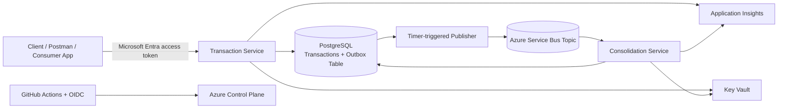

# Architecture Overview

## 1. Architectural Context

The challenge requires two core capabilities:

- transaction control;
- daily consolidated balance.

It also introduces an important non-functional requirement:

> the transaction service must remain available even if the daily consolidation service fails.

That requirement is the main architectural driver of the solution.

Because of that, the system is intentionally separated into:

- a **write path**, optimized for low latency, durability and availability;
- a **processing path**, optimized for asynchronous consolidation, recoverability and independent scale.

This is a deliberate architectural trade-off in favor of availability and resilience over immediate strong consistency of derived data.

---

## 2. High-Level Architecture

This design favors **availability, decoupling and resilience** over strict immediate consistency.

---

## 3. Throughput and Availability Strategy

The system was designed to eliminate bottlenecks between transaction ingestion and balance computation.

By isolating the transaction write path from the balance read model, the system ensures that high write throughput does not impact query performance.

Daily balance queries are executed against a consolidated and indexed data store, providing fast and predictable response times.

Asynchronous processing via messaging enables horizontal scalability of the consolidation process, allowing the system to handle increased load without degrading availability.

This approach ensures that the system meets and exceeds the requirement of handling high request rates while tolerating partial processing delays without affecting user-facing operations.
