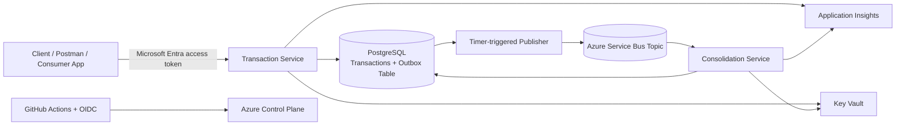

# Architecture Overview

## 1. Architectural Context

The challenge requires two core business capabilities:

- transaction control;
- daily consolidated balance.

It also defines a critical non-functional requirement:

> the transaction service must remain available even if the daily consolidation service fails.

That requirement is the main driver of the architecture.

Instead of designing a synchronous end-to-end flow, the solution separates the system into:

- a **write path**, optimized for low-latency and availability;
- a **processing path**, optimized for asynchronous consolidation and recoverability.

This design favors **availability, decoupling and resilience** over strict immediate consistency.

---

## 2. High-Level Architecture

