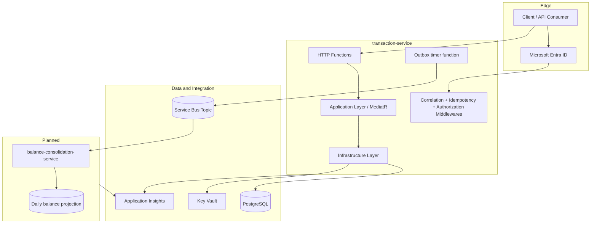

# Enterprise architecture note

## Context

The challenge requires two business capabilities:

1. a service that records daily debit and credit entries;
2. a service that provides the consolidated daily balance.

The current implementation fully addresses the first capability and lays the technical foundation for the second one with an event-driven contract.

## Component view

## Main decisions

### Serverless first
Azure Functions was chosen to optimize delivery speed and operational simplicity. It is a strong fit for bursty workloads and allows the outbox timer to be hosted in the same workload.

### Layered monorepo
The repository is organized by bounded capability but keeps infra, migrations and the first service together. This reduces setup overhead during the initial phase and still leaves clear extraction points for future services.

### Outbox instead of synchronous consolidation
The transaction write path should not become unavailable when the consolidation flow fails. For that reason, the write model persists the event in an outbox table and publishes it asynchronously. This choice directly supports the non-functional requirement that the transaction service remains available even if the consolidated service is down.

### Idempotency at the write edge
The service stores an idempotency key and request hash. This reduces duplicate write risk, improves safety for retries and creates a base for consumer idempotency on the future consolidation side.

## Observability recommendations

Current code already includes Application Insights. The next step is to standardize metrics such as:

- HTTP request rate, success rate and latency per endpoint.
- Outbox backlog size.
- Outbox processing batch duration.
- Publish success/failure rate to Service Bus.
- Function cold start and execution duration.
- Consolidation lag once the second service is implemented.

Recommended dashboards:

- API traffic and error rate.
- Outbox operational health.
- Service Bus delivery and dead-letter trends.
- Database saturation and connection pool health.

## Future network hardening

The current setup is intentionally simple for the challenge. A production-hardened version should evolve to:

- VNet integration for Function Apps.
- Dedicated subnets for app integration and delegated database subnet.
- PostgreSQL private access.
- Private endpoints for Key Vault, Storage Account and Service Bus where appropriate.
- Egress control and firewall rules aligned with the deployment strategy.
